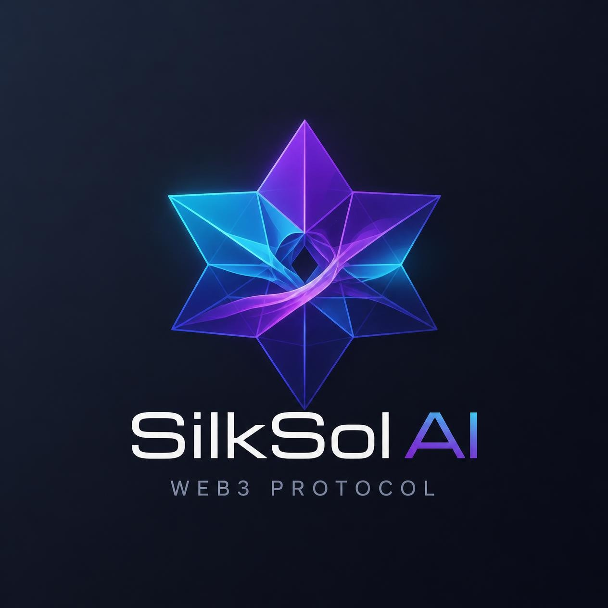
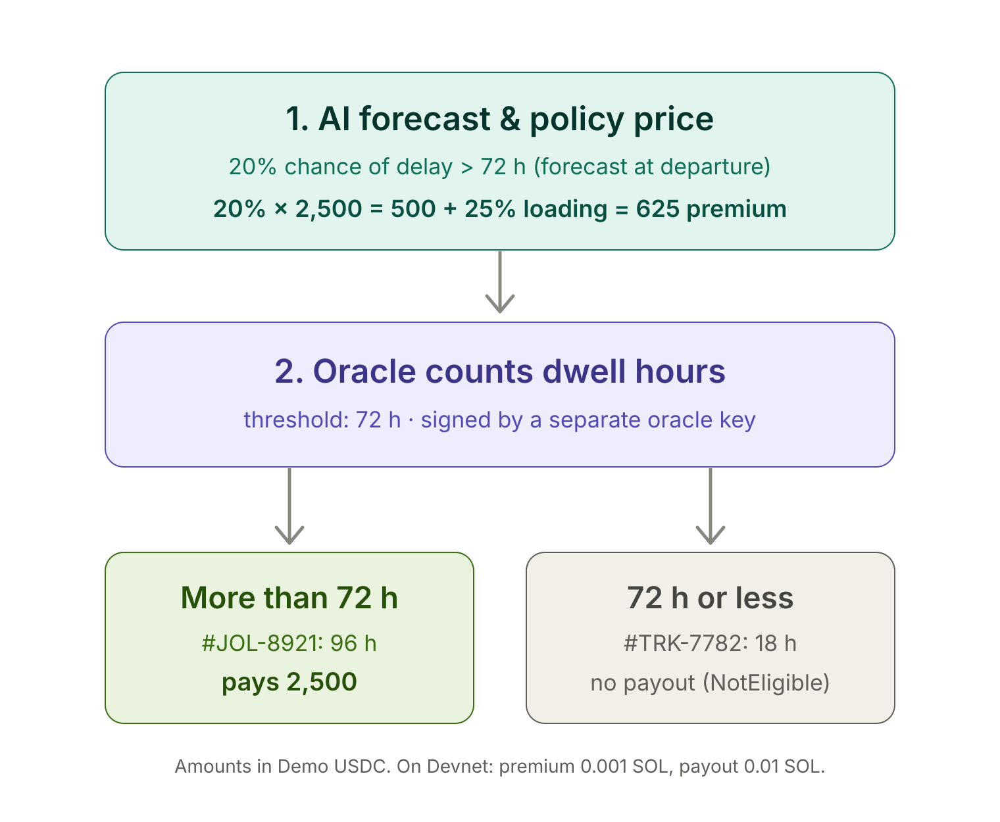
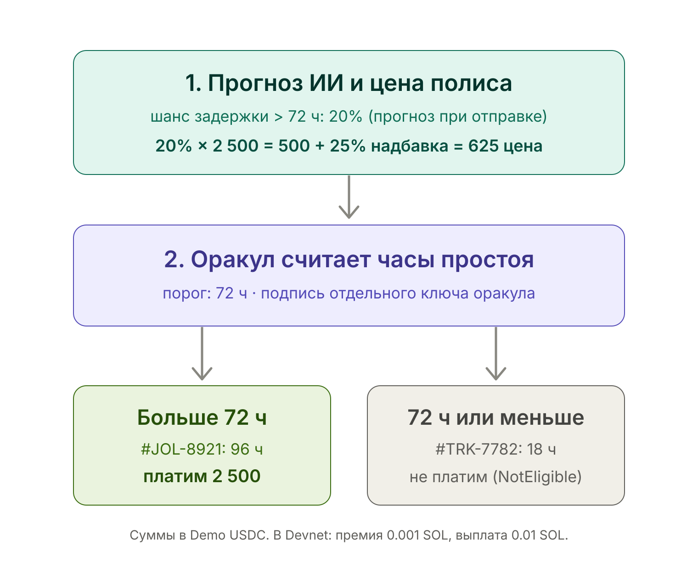
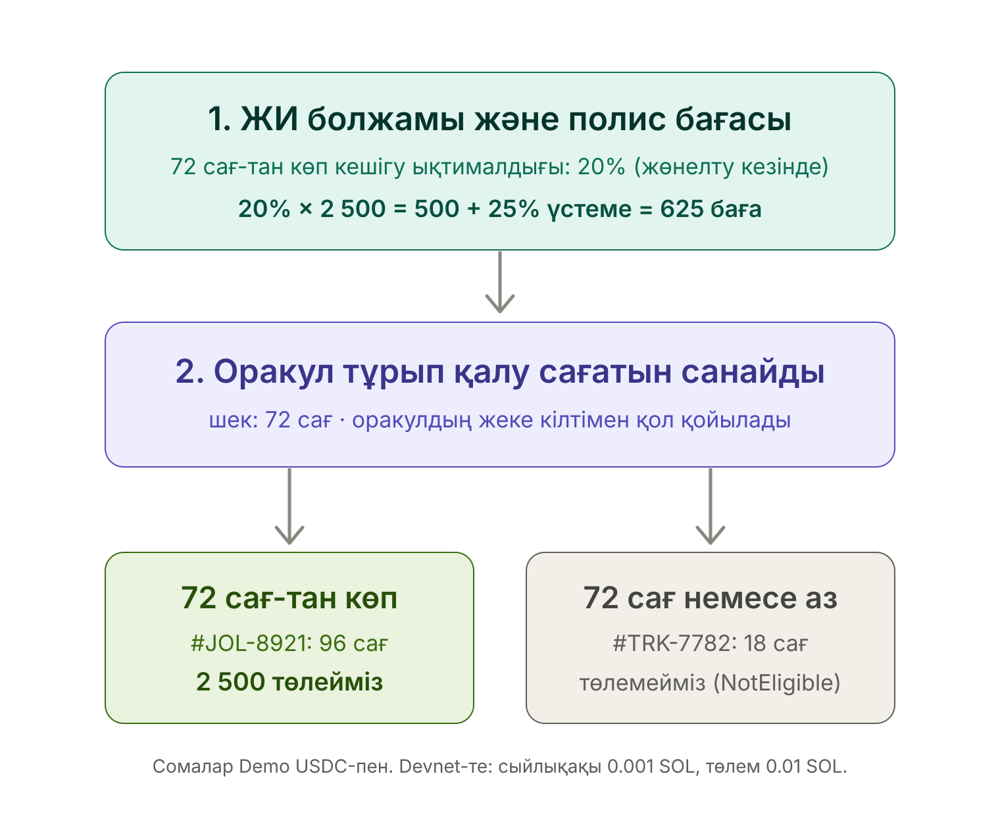

<p align="center"></p>

<h1 align="center">🚢 SilkSol AI ⚓️</h1>

<p align="center">
  <em>Predictive Risk Analytics & Parametric Settlement Protocol for Middle Corridor (TMTM) Logistics on Solana</em>
</p>

<p align="center">
  
  <a href="./e2e/dashboard.spec.ts"></a>
  <a href="./anchor/tests/silksol_escrow.test.ts"></a>
  <a href="https://explorer.solana.com/address/Gu7gKXNnp95qTvaDwoq3NB9JCqBQLmriHQgKrFzJAr9Z?cluster=devnet"></a>
  
</p>

<p align="center">
  <a href="https://silksol.datariglab.kz/">🌐 Live dApp MVP</a> |
  <a href="https://www.loom.com/share/16e3dec8fe1f4a1488efa34fc906ea41">🎥 dApp Demo Video</a> |
  <a href="https://www.loom.com/share/7a5fc765245d46a6aed6e34b6acee973">🎤 Pitch Video</a> |
  <a href="https://drive.google.com/file/d/1k0Qk2oTvkdtilKcwOynkIjv-V1wDtucf/view?usp=sharing">📊 Presentation (PDF)</a> |
  <a href="./docs/ARCHITECTURE.md">📚 Documentation</a>
</p>

<p align="center">
  <b>English</b> · <a href="#-русский">Русский</a> · <a href="#-қазақша">Қазақша</a>
</p>

---

## 💡 Executive Summary

SilkSol AI is a B2B dApp MVP combining telemetry risk analytics with automated Solana smart contracts to demonstrate instant delay mitigation and dispute resolution along the Trans-Caspian International Transport Route (TMTM / Middle Corridor).

Traditional supply chain insurance claims take 60–90+ days due to manual paperwork and dispute resolution. SilkSol AI demonstrates how verified telemetry feeds trigger automated, rule-based USDC payouts via non-custodial Solana Escrow Vaults, Payouts in [KZTE](https://cointelegraph.com/news/kazakhstan-solana-mastercard-stablecoin-kzte), the tenge stablecoin on Solana, are a planned direction to explore.

---

## 🧑‍⚖️ Try it in 2 minutes (judges)

1. Install [Phantom](https://phantom.com) → **Settings → Developer Settings → Testnet Mode → Solana Devnet**.
2. Get free Devnet SOL at [faucet.solana.com](https://faucet.solana.com) (only needed for step 5; the payout in step 4 costs you nothing).
3. Open the [live dApp](https://silksol.datariglab.kz/) → **Connect wallet → Phantom**.
4. Scroll to **Autonomous settlement → Review settlement**. No signature is needed: the SilkSol AI insurer runs the claim on-chain and **+0.01 Devnet SOL arrives in your wallet** within seconds. Click the `tx:` link to see it in Solana Explorer, including the memo `SilkSol AI | Parametric payout | Cargo #JOL-8921 | Delay 96h > 72h | …`. Now select **#TRK-7782** (dwell 18 h) and click **Review settlement** again: the escrow program **refuses** the claim (`NotEligible`), and nothing is paid.
5. Full lifecycle in the **Parametric policy & claim engine** panel: **Issue Parametric Policy** (you sign a 0.001 SOL premium) → **Lock Collateral & Sign** (insurer locks 0.01 SOL in an escrow vault for you) → **Trigger Oracle Event** (the oracle reports that cargo's dwell time; the program pays only if it is over 72 h).

> Without a wallet everything still works in demo mode with clearly labelled simulated transactions.

---

## 🏗 System Architecture

```text
 [IoT Sensors / GPS Trackers / Railway Telemetry]
                        │  (Simulated Telemetry API / Webhooks)
                        ▼
 ╔═════════════════════════════════════════════════════════╗
 ║ 1. Predictive Risk Engine (Analytics & Scoring)         ║
 ║  • Dynamic Risk Indexing & Delay Forecasting Logic      ║
 ╚═════════════════════════════════════════════════════════╝
                        │  (Risk Score Payload / Signed Feeds)
                        ▼
 ╔═════════════════════════════════════════════════════════╗
 ║ 2. Solana Blockchain Layer (Devnet Smart Contracts)     ║
 ║  • Compressed NFTs (cNFT): Immutable Freight Logs       ║
 ║  • Program Escrow Vault: Automated Collateralized USDC  ║
 ║  • Deterministic Settlement: Parametric Trigger Logic   ║
 ║  • KZTE Payouts: Tenge Stablecoin (to be explored)      ║
 ╚═════════════════════════════════════════════════════════╝
                        │  (Web3 Wallet RPC / Program Logs)
                        ▼
 ╔═════════════════════════════════════════════════════════╗
 ║ 3. Enterprise Frontend Dashboard (React / Tailwind)     ║
 ║  • Real-Time Container Tracking & Interactive Maps      ║
 ║  • Dual-Currency Escrow & Settlement Audit Logs         ║
 ╚═════════════════════════════════════════════════════════╝
```

---

## ✨ Key Features

- **Status & Risk Indexing:** High-level tracking of transit checkpoints across Caspian ports (Aktau/Kuryk) and regional hubs.
- **State Compression (cNFTs):** Cost-efficient storage of supply chain audit trails on Solana.
- **Parametric Escrow Prototype:** Automated USDC payout triggers upon verified delay thresholds (`dwell_time > threshold`).
- **Tenge payouts (planned):** KZTE, a tenge stablecoin on Solana, to be explored; the cover itself runs through a licensed insurer partner (target: AIFC sandbox).
- **Zero Paperwork:** Instant, transparent, and verifiable event-driven settlement.

---

## ⛓ On-chain Escrow Program (Devnet)

The parametric core runs on Solana as the Anchor program [`silksol_escrow`](./anchor/programs/silksol_escrow/src/lib.rs) — program ID [`Gu7gKXNn…Ar9Z`](https://explorer.solana.com/address/Gu7gKXNnp95qTvaDwoq3NB9JCqBQLmriHQgKrFzJAr9Z?cluster=devnet).

`initialize_vault` → `submit_telemetry` → `evaluate_trigger` (`dwell_time > threshold`) → `settle_payout` → `close_vault`

With Phantom/Solflare connected on Devnet, roles are split as in production: the **SilkSol AI insurer treasury** ([`LxtEpBFN…mv7C`](https://explorer.solana.com/address/LxtEpBFNvEEBmESNA6ExiYHdrdZCfNGkCbndLVimv7C?cluster=devnet)) locks collateral, a **separate oracle key** ([`GKu4Dmw4…6RDe`](https://explorer.solana.com/address/GKu4Dmw4TkKu2WJNX7weQrMw7AjjmrHtovxFrX7E6RDe?cluster=devnet)) signs the dwell-time telemetry in a [serverless function](./oracle/netlify/functions/insurer.mts), and the **connected wallet is the beneficiary** that receives the payout (0.01 Devnet SOL as a USDC stand-in). The program enforces the split: it rejects a vault whose oracle is the insurer, and the insurer cannot reclaim collateral before the cover period (`coverage_end`) ends. Every transaction carries an SPL **Memo** (`SilkSol AI | Parametric payout | Cargo #… | Delay 96h > 72h | Policy … | Report sha256:…`), so it is self-describing in Explorer. cNFT audit logs are simulated; KZTE amounts are shown for illustration only. Specs: [CONTRACT_SPECS.md](./docs/CONTRACT_SPECS.md).

```bash
cd anchor && anchor build
solana-test-validator --reset --bpf-program Gu7gKXNnp95qTvaDwoq3NB9JCqBQLmriHQgKrFzJAr9Z target/deploy/silksol_escrow.so &
node --test --experimental-strip-types tests/*.test.ts   # 13 program tests
```

---

## 🛠 Tech Stack

- **Blockchain:** Solana Devnet, Anchor 1.2 escrow program (Rust), Compressed NFTs (cNFT / State Compression, simulated)
- **Tokens & Escrow:** SPL-Token / Demo USDC, KZTE payouts (planned, to be explored)
- **Risk Engine:** Predictive Risk Scoring Logic & Parametric Oracle Simulator
- **Frontend & UI:** React, TypeScript, Tailwind CSS, Recharts
- **Web3 Integration:** `@solana/web3.js`, `@solana/wallet-adapter-react`
- **Insurer/oracle:** Netlify serverless function ([`oracle/`](./oracle))

---

## 🧪 Testing & E2E Validation

### ✅ Verification status — all green (Oct 8, 2026)

| Check | Result |
|---|---|
| Solana program tests (local validator, [`anchor/tests`](./anchor/tests/silksol_escrow.test.ts)) | ✅ **13 / 13 passed** |
| E2E suite against a local build | ✅ **17 / 17 passed** |
| E2E suite against the live dApp ([silksol.datariglab.kz](https://silksol.datariglab.kz/)) | ✅ **17 / 17 passed** |
| Production build & TypeScript type-check | ✅ **Passed** |
| Program deployed to Devnet | ✅ [`Gu7gKXNn…Ar9Z`](https://explorer.solana.com/address/Gu7gKXNnp95qTvaDwoq3NB9JCqBQLmriHQgKrFzJAr9Z?cluster=devnet) |
| Insurer payout to a user wallet with memo (Review settlement), signed by the insurer **and** the separate oracle key | ✅ [payout tx](https://explorer.solana.com/tx/7AdYfm732GsXg5NC7NkhfcUSHvLstGMkgmPw1LcdihS1LtTYSe84s1ciTfy9pQ4pNXvPxgLfJNnTjKKjVY3rHad?cluster=devnet) (+0.01 SOL to the beneficiary) |
| Live insurer/oracle ([silksol-oracle.netlify.app](https://silksol-oracle.netlify.app)): lock collateral → oracle trigger → payout (#KZL-4107, 110h > 72h) | ✅ [lock tx](https://explorer.solana.com/tx/4VGWdvS1G2rBzLbewsb2urUzGGXuHc9vSXa7XjXxk599KhegTwqDPFFRKfa1uG1r6EyUEmFwRiA5LaECb5PMLawi?cluster=devnet) · [payout tx](https://explorer.solana.com/tx/65smYPFhEPfLtT6uvgURVoSmxpMWUK5y9sD7RXve9XFUWsd4AsexiAFKYv8mY77CofGb3HKhX2P2GhRK466vdXzQ?cluster=devnet) |
| Program refuses a vault whose oracle is the insurer; refuses #TRK-7782 (18h ≤ 72h) | ✅ `OracleIsInsurer` · `NotEligible` (simulated on Devnet, nothing lands) |

### E2E suite

A [Playwright](https://playwright.dev) suite (17 tests, [`e2e/dashboard.spec.ts`](./e2e/dashboard.spec.ts)) drives the dApp in a real Chromium browser exactly as a judge would — no browser wallet, so every signature takes the dApp's simulated Devnet path and no funds move. A ready-to-run [GitHub Actions workflow](./.github/workflows/e2e.yml) is included.

| Suite | Coverage |
|---|---|
| **Dashboard & Telemetry** | Demo disclaimer, KPI metrics, Middle Corridor route stops, Aktau congestion alert, the selected cargo's oracle dwell time against the 72 h trigger. |
| **Web3 Wallet (demo mode)** | Phantom / Solflare Devnet wallet menu and graceful fallback to simulated signatures. |
| **Cargo Filters** | In Transit / High Risk Delay / Escrow Triggered filters isolate the right shipments. |
| **Parametric Policy Lifecycle** | Issue → Lock Collateral & Sign → Trigger Oracle Event → Claim Paid Out (2,500 Demo USDC ≈ 1,250,000 KZTE, illustrative); the trigger is refused for a cargo under 72 h; premium = AI chance of delay at departure × payout + 25% loading. |
| **Autonomous Settlement** | Review settlement acknowledges the 2,500 Demo USDC payout and settles the cargo selected in the table, not a fixed one; a cargo under the threshold gets no payout. |
| **Caspian Risk Vault** | Demo USDC deposit updates stake; amounts above the wallet balance are rejected. |
| **cNFT Audit Trail** | Each policy event is logged as a compressed Merkle checkpoint (leaf + root). |
| **On-chain Escrow Program** | Policy panel links to the deployed Devnet program and shows its live status. |

Run the suite:

```bash
npx playwright install chromium   # one-time browser download
npm run test:e2e                  # against a local dev server (started automatically)
npm run test:e2e:live             # against the live dApp at silksol.datariglab.kz
```

---

## 📚 Documentation & Architecture Specs

- **[Architecture Flow](./docs/ARCHITECTURE.md)** — end-to-end system design, data flow, and on-chain/off-chain boundaries.
- **[Smart Contract Specs](./docs/CONTRACT_SPECS.md)** — Escrow Vault program accounts, instructions, and settlement trigger logic.
- **[AIFC Sandbox Regulatory Notes](./docs/AIFC_SANDBOX.md)** — regulatory concept for the AIFC sandbox and planned KZTE payouts.
- **[Presentation (PDF)](https://drive.google.com/file/d/1k0Qk2oTvkdtilKcwOynkIjv-V1wDtucf/view?usp=sharing)** — pitch deck on Google Drive.

---

## 📊 Market, sources & positioning

**Market data sources.** The corridor figures in the pitch deck (and the TAM / SAM / SOM sizing built on them) come from public sources:

- **World Bank**, *Integration: World-Class Trade Logistics Along the Trans-Caspian Transport Corridor* (Sept 28, 2026): investments could more than triple corridor volumes and halve travel times by 2040; port and border delays are the main bottleneck. [Press release](https://www.worldbank.org/en/news/press-release/2026/09/28/trans-caspian-transport-corridor-investments-spur-growth-and-create-millions-jobs)
- **Argus** freight assessment (Sept 2026): Xi'an → Tbilisi/Poti **$6,900–7,200 per 40HC**, Xi'an → Alat/Baku $6,750–7,200 per 40HC. [Trend.az summary](https://www.trend.az/casia/kazakhstan/4229949.html)
- **TITR / Ministry of Transport of Kazakhstan**: Middle Corridor volumes grew from 0.8 to **~4.5 million tonnes a year**. [The Astana Times](https://astanatimes.com/2026/03/trans-caspian-transport-route-cargo-volumes-increase-fivefold-in-seven-years/)

**Global Web3 benchmarks.** Parametric cover on-chain is proven in other verticals: **Etherisc** (flight-delay and crop insurance), **Arbol** (parametric weather cover), **Nayms** (regulated on-chain insurance marketplace). SilkSol AI applies the same model to a corridor nobody covers: Caspian port dwell times (Aktau, Kuryk, Baku), with an AIFC sandbox path and tenge (KZTE) payouts planned.

**Business model & risk capital.**
- **Who pays:** freight forwarders and shippers pay a premium per cargo, priced by the risk score.
- **Who carries the risk:** in production, a licensed insurer partner funds the escrow vaults (target: AIFC regulatory sandbox). SilkSol AI is the technology layer: risk pricing, oracle and on-chain settlement.
- **Caspian Risk Vault:** the liquidity vault in the dApp (TVL, APY) is a simulated later-phase concept, intended only for qualified investors under AIFC rules.

**Known limitations of the MVP.**
- The insurer and the oracle are separate keys and the program enforces it (`OracleIsInsurer`), but both keys are still run by one operator (SilkSol AI). Next: an independent oracle (port/rail data provider), then a multi-signer oracle network.
- Cover lasts 7 days in the demo (`coverage_end`). Vaults that were locked but never triggered stay open until then; [`oracle/reclaim-expired.ts`](./oracle/reclaim-expired.ts) returns their collateral to the treasury afterwards.
- The program is upgradeable on Devnet: the upgrade authority is the founder's key [`7u1Hy…bAJG`](https://explorer.solana.com/address/7u1HyAzKEeMtNLwfNKsRM9VRizneu9AV7vziNRNVbAJG?cluster=devnet), so whoever holds it could change the rules. Before Mainnet the upgrade authority moves to a multisig (e.g. Squads) with a time delay, and after an audit the program is frozen (no upgrade authority), so the rules a shipper buys cannot change under them.
- Dwell times are simulated per demo cargo (#JOL-8921 96 h, #KZL-4107 110 h, #MCC-2048 6 h, #TRK-7782 18 h). The oracle reads them on the server; the browser cannot choose them.
- Payouts use Devnet SOL as a USDC stand-in; cNFT audit logs are simulated; KZTE amounts are illustrative.
- The demo insurer is rate-limited (per wallet, plus 10 treasury transactions per hour and 40 per day in total, locks and payouts combined) to keep the Devnet treasury alive.
- A daily health check ([`oracle/netlify/functions/monitor.mjs`](./oracle/netlify/functions/monitor.mjs), Netlify scheduled function, 09:00 Aqtau) reads the treasury balance, open escrow vaults and the live dApp, and sends a 🟢/🔴 report to the maintainer's Telegram; below 1 SOL it raises an urgent top-up alert. Read-only: it holds no keys.

---

## 🧮 Pricing, basis risk & oracle trust

<p align="center"></p>

**How the premium is priced.** At departure the AI forecasts the chance that the cargo's port dwell will exceed 72 h. Premium = chance × payout + 25% insurer loading (expenses, capital, profit). For #JOL-8921: 20% × 2,500 = 500 expected loss, plus 25% = **625 Demo USDC**. The live "AI risk" in the dashboard (68% for #JOL-8921 today) is the risk after the cargo got stuck, and cover is never priced on it: nobody can cheaply insure a house that is already on fire. Code: [`premiumFor`](./src/components/solana/PolicyEngine.tsx). The payout stays a plain on-chain rule (`dwell_time > threshold`); the AI never decides a claim.

**Known weak spots of parametric cover and how we handle them**

| Risk | Example | How SilkSol AI handles it | Status |
|---|---|---|---|
| **Payout without a loss** | Cargo dwelled 73 h, the shipper lost nothing | Sold as cover for frozen cash, not as cargo insurance. The shipper sets the payout from their own cost of delay (demurrage, financing, penalties). Each policy is tied to a real shipment (bill of lading) and capped at its declared value. | 📄 policy terms |
| **Loss without a payout** | 70 h dwell, a contract was lost, no payout | Tiered payout instead of a cliff (e.g. 48–72 h 25%, 72–96 h 50%, over 96 h 100%) and a threshold the client chooses (48 / 72 / 96 h; a lower threshold costs more, priced by the same AI). SilkSol is a fast top-up next to classic cargo insurance, which still covers large losses. | 📄 next: tiers in the escrow program |
| **Who vouches for the number** | Insurer and data source are the same party | Today the oracle key is separate from the insurer and the program enforces it (`OracleIsInsurer`); every payout carries the report hash in its memo. Next: independent data (public AIS positions of Caspian ferries at Aktau and Baku, then port and rail feeds), 2-of-3 oracle signatures, and a 24 h dispute window before payout. | ✅ split keys · 📄 rest |

✅ in code · 📄 planned

---

## 🗺 Roadmap: from Devnet MVP to production

| | Today (Devnet MVP) | Next | Production |
|---|---|---|---|
| **Escrow** | ✅ Anchor program live on Devnet, 13 program tests | Security review and audit | Mainnet deployment |
| **Payout currency** | ✅ Devnet SOL as a USDC stand-in | SPL USDC escrow vaults | USDC, then KZTE payouts (to be explored) |
| **Oracle** | ✅ Oracle key separate from the insurer, enforced on-chain | Port and rail telemetry feeds (Aktau, Baku) | Multi-signer / decentralized oracle network |
| **Audit trail** | 🟡 cNFT logs simulated | Real State Compression (Bubblegum) | Every cargo event logged as a cNFT |
| **Risk engine** | 🟡 Rule-based scoring on simulated telemetry | Historical dwell-time data from operator partners | Trained model prices premiums live |
| **Regulatory** | 📄 AIFC Sandbox concept | AIFC Sandbox application | Licensed insurer partner |

✅ live · 🟡 simulated · 📄 planned

**Risk model plan.** There is no trained model yet: no public dataset of Trans-Caspian dwell times exists. Training starts once operator partners share 12–24 months of historical port and rail events (arrival/departure times, queue length, weather, season, cargo type). For this kind of tabular data the baseline is gradient-boosted trees (e.g. LightGBM or XGBoost), validated on time-based splits so the model is always tested on future shipments. The final choice depends on the data. The model only prices premiums; payouts stay a deterministic on-chain rule (`dwell_time > threshold`).

---

## ⚠️ MVP Status & Intellectual Property Notice

- **MVP Data & Telemetry:** This public repository is an interactive hackathon MVP. All telemetry streams, risk metrics, and oracle events utilize synthetic/simulated data to demonstrate the automated workflow without requiring live hardware sensors.
- **Deterministic Triggers:** AI/ML components represent predictive risk scoring logic; payout triggers are strictly deterministic rule-based smart contracts (`dwell_time > threshold`).
- **IP Protection:** The production risk-scoring logic and future model parameters will remain confidential assets of SilkSol AI. This public MVP uses a simplified rule-based scorer on simulated data (see [Roadmap](#-roadmap-from-devnet-mvp-to-production)).
- **Regulatory Roadmap:** Tenge payouts in [KZTE](https://cointelegraph.com/news/kazakhstan-solana-mastercard-stablecoin-kzte) (a tenge stablecoin on Solana, piloted in the National Bank of Kazakhstan's sandbox) are a direction to explore, not an integration. The digital tenge (eKZT) runs on the National Bank's own platform, not on Solana, so it is not the target. Selling cover requires a licensed insurer partner (target: AIFC sandbox).

---

## 🚀 Getting Started (Local Development)

### Prerequisites
- Node.js (v18+)
- npm / yarn / pnpm

### Setup Instructions

1. **Clone repository:**
   ```bash
   git clone https://github.com/s0nakh/silksol-ai.git
   cd silksol-ai
   ```

2. **Install dependencies:**
   ```bash
   npm install
   ```

3. **Configure environment variables:**
   ```bash
   cp .env.example .env
   # VITE_INSURER_URL points at the insurer/oracle Netlify Function (oracle/).
   # Its treasury and oracle secrets are set only in Netlify, never in git.
   ```

4. **Launch local server:**
   ```bash
   npm run dev
   ```

5. **(Optional) Deploy your own insurer/oracle** — a free Netlify Function in [`oracle/`](./oracle):
   ```bash
   cd oracle && netlify sites:create --name <your-oracle>
   netlify env:set SILKSOL_TREASURY_SECRET "$(cat <devnet-treasury-keypair>.json)"
   netlify env:set SILKSOL_ORACLE_SECRET "$(cat <separate-oracle-keypair>.json)"
   ./build.sh && netlify deploy --prod --no-build --dir public --functions dist-functions
   ```

---

## 📜 License & Copyright

Copyright © 2026 **SilkSol AI / s0nakh**. All rights reserved.
*Published for demonstration and evaluation at:*
- *Colosseum Crypto World's Fair Hackathon*
- *Colosseum Crypto World's Fair Hackathon | Superteam Kazakhstan Track*

---

## 🇷🇺 Русский

<details>
<summary><b>Открыть русскую версию</b></summary>

<p align="center"><em>Предиктивная аналитика рисков и протокол параметрических выплат для логистики Среднего коридора (ТМТМ) на Solana</em></p>

[🌐 Приложение](https://silksol.datariglab.kz/) · [🎥 Демо-видео](https://www.loom.com/share/16e3dec8fe1f4a1488efa34fc906ea41) · [🎤 Питч-видео](https://www.loom.com/share/7a5fc765245d46a6aed6e34b6acee973) · [📊 Презентация (PDF)](https://drive.google.com/file/d/1k0Qk2oTvkdtilKcwOynkIjv-V1wDtucf/view?usp=sharing) · [📚 Документация](./docs/ARCHITECTURE.md)

### 💡 Краткое описание

SilkSol AI — MVP B2B-приложения (dApp), которое объединяет аналитику рисков на основе телеметрии с автоматическими смарт-контрактами Solana. Оно показывает, как можно мгновенно компенсировать задержки грузов и разрешать споры на Транскаспийском международном транспортном маршруте (ТМТМ / Средний коридор).

Классические страховые выплаты в цепочках поставок занимают 60–90+ дней из-за ручного документооборота и споров. SilkSol AI показывает, как проверенные данные телеметрии запускают автоматические выплаты в USDC по строгим правилам через некастодиальные эскроу-хранилища Solana. В планах изучить выплаты в [KZTE](https://cointelegraph.com/news/kazakhstan-solana-mastercard-stablecoin-kzte), тенговом стейблкоине на Solana.

### 🧑‍⚖️ Попробовать за 2 минуты (для судей)

1. Установите [Phantom](https://phantom.com) → **Settings → Developer Settings → Testnet Mode → Solana Devnet**.
2. Получите бесплатные Devnet SOL на [faucet.solana.com](https://faucet.solana.com) (нужны только для шага 5; выплата на шаге 4 вам ничего не стоит).
3. Откройте [приложение](https://silksol.datariglab.kz/) → **Connect wallet → Phantom**.
4. Прокрутите до блока **Autonomous settlement** и нажмите **Review settlement**. Подписывать ничего не нужно: страховщик SilkSol AI проводит страховой случай в блокчейне, и через несколько секунд **на ваш кошелёк приходит +0.01 Devnet SOL**. По ссылке `tx:` откроется транзакция в Solana Explorer вместе с пометкой (Memo) `SilkSol AI | Parametric payout | Cargo #JOL-8921 | Delay 96h > 72h | …`. Теперь выберите груз **#TRK-7782** (простой 18 ч) и снова нажмите **Review settlement**: эскроу-программа **отказывает** в выплате (`NotEligible`), деньги не уходят.
5. Полный цикл — в панели **Parametric policy & claim engine**: **Issue Parametric Policy** (вы подписываете премию 0.001 SOL) → **Lock Collateral & Sign** (страховщик блокирует для вас 0.01 SOL в эскроу-хранилище) → **Trigger Oracle Event** (оракул сообщает простой этого груза; программа платит, только если он больше 72 ч).

> Без кошелька всё тоже работает — в демо-режиме, с явно помеченными симулированными транзакциями.

### 🏗 Архитектура системы

```text
 [IoT-датчики / GPS-трекеры / ж/д телеметрия]
                        │  (Симулированный API телеметрии / вебхуки)
                        ▼
 ╔═════════════════════════════════════════════════════════╗
 ║ 1. Предиктивный движок рисков (аналитика и скоринг)     ║
 ║  • Динамический индекс риска и прогноз задержек         ║
 ╚═════════════════════════════════════════════════════════╝
                        │  (Оценка риска / подписанные данные)
                        ▼
 ╔═════════════════════════════════════════════════════════╗
 ║ 2. Блокчейн-слой Solana (смарт-контракты в Devnet)      ║
 ║  • Сжатые NFT (cNFT): неизменяемые журналы перевозок    ║
 ║  • Эскроу-хранилище: автоматический залог в USDC        ║
 ║  • Детерминированная выплата: параметрический триггер   ║
 ║  • Выплаты в KZTE: тенговый стейблкоин (изучим)         ║
 ╚═════════════════════════════════════════════════════════╝
                        │  (RPC кошелька Web3 / логи программы)
                        ▼
 ╔═════════════════════════════════════════════════════════╗
 ║ 3. Корпоративный дашборд (React / Tailwind)             ║
 ║  • Отслеживание контейнеров и интерактивная карта       ║
 ║  • Двухвалютный эскроу и журналы выплат                 ║
 ╚═════════════════════════════════════════════════════════╝
```

### ✨ Ключевые возможности

- **Статусы и индексация рисков:** отслеживание транзитных точек в каспийских портах (Актау/Курык) и региональных хабах.
- **Сжатие состояния (cNFT):** недорогое хранение журналов аудита цепочки поставок в Solana.
- **Прототип параметрического эскроу:** автоматическая выплата в USDC при подтверждённом превышении порога задержки (`dwell_time > threshold`).
- **Выплаты в тенге (в планах):** KZTE, тенговый стейблкоин на Solana, планируем изучить; само страхование идёт через лицензированного страховщика-партнёра (цель: песочница AIFC).
- **Ноль бумаг:** мгновенные, прозрачные и проверяемые выплаты по событию.

### ⛓ Эскроу-программа в блокчейне (Devnet)

Параметрическое ядро работает в Solana как Anchor-программа [`silksol_escrow`](./anchor/programs/silksol_escrow/src/lib.rs) — ID программы [`Gu7gKXNn…Ar9Z`](https://explorer.solana.com/address/Gu7gKXNnp95qTvaDwoq3NB9JCqBQLmriHQgKrFzJAr9Z?cluster=devnet).

`initialize_vault` → `submit_telemetry` → `evaluate_trigger` (`dwell_time > threshold`) → `settle_payout` → `close_vault`

При подключённом Phantom/Solflare в Devnet роли разделены, как в реальной работе: **казна страховщика SilkSol AI** ([`LxtEpBFN…mv7C`](https://explorer.solana.com/address/LxtEpBFNvEEBmESNA6ExiYHdrdZCfNGkCbndLVimv7C?cluster=devnet)) блокирует залог, **отдельный ключ оракула** ([`GKu4Dmw4…6RDe`](https://explorer.solana.com/address/GKu4Dmw4TkKu2WJNX7weQrMw7AjjmrHtovxFrX7E6RDe?cluster=devnet)) подписывает данные о простое в [серверной функции](./oracle/netlify/functions/insurer.mts), а **подключённый кошелёк — получатель (beneficiary)**, которому приходит выплата (0.01 Devnet SOL вместо USDC). Программа сама следит за разделением ролей: отклоняет хранилище, где оракул совпадает со страховщиком, и не даёт страховщику забрать залог до конца срока покрытия (`coverage_end`). В каждой транзакции есть SPL **Memo** (`SilkSol AI | Parametric payout | Cargo #… | Delay 96h > 72h | Policy … | Report sha256:…`), поэтому в Explorer сразу видно, что это за операция. Журнал cNFT пока симулируется; суммы в KZTE показаны только для примера. Спецификация: [CONTRACT_SPECS.md](./docs/CONTRACT_SPECS.md).

```bash
cd anchor && anchor build
solana-test-validator --reset --bpf-program Gu7gKXNnp95qTvaDwoq3NB9JCqBQLmriHQgKrFzJAr9Z target/deploy/silksol_escrow.so &
node --test --experimental-strip-types tests/*.test.ts   # 13 тестов программы
```

### 🛠 Технологии

- **Блокчейн:** Solana Devnet, эскроу-программа на Anchor 1.2 (Rust), сжатые NFT (cNFT / State Compression, симуляция)
- **Токены и эскроу:** SPL-Token / Demo USDC, выплаты в KZTE (в планах изучить)
- **Движок рисков:** логика предиктивного скоринга и симулятор параметрического оракула
- **Фронтенд и UI:** React, TypeScript, Tailwind CSS, Recharts
- **Web3-интеграция:** `@solana/web3.js`, `@solana/wallet-adapter-react`
- **Страховщик/оракул:** бессерверная функция Netlify ([`oracle/`](./oracle))

### 🧪 Тестирование и E2E-проверка

#### ✅ Статус проверки — всё зелёное (8 октября 2026)

| Проверка | Результат |
|---|---|
| Тесты программы Solana (локальный валидатор, [`anchor/tests`](./anchor/tests/silksol_escrow.test.ts)) | ✅ **13 / 13 пройдено** |
| E2E-набор на локальной сборке | ✅ **17 / 17 пройдено** |
| E2E-набор на живом приложении ([silksol.datariglab.kz](https://silksol.datariglab.kz/)) | ✅ **17 / 17 пройдено** |
| Продакшн-сборка и проверка типов TypeScript | ✅ **Пройдено** |
| Программа развёрнута в Devnet | ✅ [`Gu7gKXNn…Ar9Z`](https://explorer.solana.com/address/Gu7gKXNnp95qTvaDwoq3NB9JCqBQLmriHQgKrFzJAr9Z?cluster=devnet) |
| Выплата страховщика на кошелёк пользователя с Memo (Review settlement), подписи страховщика **и** отдельного ключа оракула | ✅ [транзакция выплаты](https://explorer.solana.com/tx/7AdYfm732GsXg5NC7NkhfcUSHvLstGMkgmPw1LcdihS1LtTYSe84s1ciTfy9pQ4pNXvPxgLfJNnTjKKjVY3rHad?cluster=devnet) (+0.01 SOL получателю) |
| Живой страховщик/оракул ([silksol-oracle.netlify.app](https://silksol-oracle.netlify.app)): залог → триггер оракула → выплата (#KZL-4107, 110 ч > 72 ч) | ✅ [залог](https://explorer.solana.com/tx/4VGWdvS1G2rBzLbewsb2urUzGGXuHc9vSXa7XjXxk599KhegTwqDPFFRKfa1uG1r6EyUEmFwRiA5LaECb5PMLawi?cluster=devnet) · [выплата](https://explorer.solana.com/tx/65smYPFhEPfLtT6uvgURVoSmxpMWUK5y9sD7RXve9XFUWsd4AsexiAFKYv8mY77CofGb3HKhX2P2GhRK466vdXzQ?cluster=devnet) |
| Программа отклоняет хранилище, где оракул = страховщик; отклоняет #TRK-7782 (18 ч ≤ 72 ч) | ✅ `OracleIsInsurer` · `NotEligible` (симуляция в Devnet, в сеть ничего не уходит) |

#### E2E-набор

Набор [Playwright](https://playwright.dev) (17 тестов, [`e2e/dashboard.spec.ts`](./e2e/dashboard.spec.ts)) проходит по приложению в настоящем браузере Chromium так же, как это сделал бы судья. Кошелька в браузере нет, поэтому все подписи идут по симулированному пути и деньги не двигаются. В репозитории есть готовый [workflow GitHub Actions](./.github/workflows/e2e.yml).

| Набор | Что проверяется |
|---|---|
| **Дашборд и телеметрия** | Демо-предупреждение, KPI, точки маршрута Среднего коридора, оповещение о заторе в Актау, простой выбранного груза по данным оракула против триггера 72 ч. |
| **Web3-кошелёк (демо-режим)** | Меню кошельков Phantom / Solflare для Devnet и корректный переход к симулированным подписям. |
| **Фильтры грузов** | Фильтры In Transit / High Risk Delay / Escrow Triggered показывают нужные грузы. |
| **Жизненный цикл полиса** | Выпуск → блокировка залога → событие оракула → выплата (2 500 Demo USDC ≈ 1 250 000 KZTE, для примера); отказ триггера для груза с простоем меньше 72 ч; премия = шанс задержки по прогнозу ИИ при отправке × выплата + 25% надбавки. |
| **Автономная выплата** | Review settlement подтверждает выплату 2 500 Demo USDC и проводит её именно по грузу, выбранному в таблице; груз ниже порога выплату не получает. |
| **Caspian Risk Vault** | Депозит Demo USDC обновляет долю; суммы больше баланса отклоняются. |
| **Журнал cNFT** | Каждое событие полиса записывается как сжатая контрольная точка Merkle (лист + корень). |
| **Эскроу-программа** | Панель полиса ссылается на развёрнутую в Devnet программу и показывает её живой статус. |

Запуск:

```bash
npx playwright install chromium   # один раз скачать браузер
npm run test:e2e                  # на локальном dev-сервере (запускается автоматически)
npm run test:e2e:live             # на живом приложении silksol.datariglab.kz
```

### 📚 Документация и спецификации

- **[Архитектура](./docs/ARCHITECTURE.md)** — устройство системы, потоки данных, граница между блокчейном и офчейном.
- **[Спецификация смарт-контракта](./docs/CONTRACT_SPECS.md)** — аккаунты, инструкции и логика триггера эскроу-программы.
- **[Заметки о песочнице AIFC](./docs/AIFC_SANDBOX.md)** — регуляторная концепция для песочницы AIFC и планы по выплатам в KZTE.
- **[Презентация (PDF)](https://drive.google.com/file/d/1k0Qk2oTvkdtilKcwOynkIjv-V1wDtucf/view?usp=sharing)** — питч-дек на Google Drive.

### 📊 Рынок, источники и позиционирование

**Источники рыночных данных.** Цифры по коридору в презентации (и оценка TAM / SAM / SOM на их основе) взяты из открытых источников:

- **Всемирный банк**, *Integration: World-Class Trade Logistics Along the Trans-Caspian Transport Corridor* (28 сентября 2026): инвестиции могут более чем утроить объёмы коридора и вдвое сократить время в пути к 2040 году; главное узкое место — задержки в портах и на границах. [Пресс-релиз](https://www.worldbank.org/en/news/press-release/2026/09/28/trans-caspian-transport-corridor-investments-spur-growth-and-create-millions-jobs)
- Ценовое агентство **Argus** (сентябрь 2026): Сиань → Тбилиси/Поти **$6 900–7 200 за 40HC**, Сиань → Алят/Баку $6 750–7 200 за 40HC. [Обзор Trend.az](https://www.trend.az/casia/kazakhstan/4229949.html)
- **ТМТМ / Министерство транспорта РК**: объём перевозок по Среднему коридору вырос с 0,8 до **~4,5 млн тонн в год**. [The Astana Times](https://astanatimes.com/2026/03/trans-caspian-transport-route-cargo-volumes-increase-fivefold-in-seven-years/)

**Глобальные Web3-бенчмарки.** Параметрическое страхование в блокчейне уже работает в других отраслях: **Etherisc** (задержки авиарейсов и агрориски), **Arbol** (погодные параметрические покрытия), **Nayms** (регулируемый on-chain рынок страхования). SilkSol AI применяет ту же модель к коридору, который никто не покрывает: простои в каспийских портах (Актау, Курык, Баку), с путём через песочницу МФЦА и планами по выплатам в тенге (KZTE).

**Бизнес-модель и страховой капитал.**
- **Кто платит:** экспедиторы и грузоотправители платят премию за каждый груз, её размер зависит от оценки риска.
- **Кто несёт риск:** в продакшене эскроу-хранилища финансирует лицензированный страховщик-партнёр (цель — регуляторная песочница МФЦА). SilkSol AI — технологический слой: оценка риска, оракул и выплаты в блокчейне.
- **Caspian Risk Vault:** хранилище ликвидности в dApp (TVL, APY) — симуляция концепции следующей фазы, только для квалифицированных инвесторов по правилам МФЦА.

**Известные ограничения MVP.**
- У страховщика и оракула разные ключи, и программа это проверяет (`OracleIsInsurer`), но оба ключа пока у одного оператора (SilkSol AI). Дальше: независимый оракул (поставщик данных порта и железной дороги), затем сеть оракулов с несколькими подписантами.
- Покрытие в демо длится 7 дней (`coverage_end`). Хранилища, где залог заблокирован, но триггер не сработал, остаются открытыми до этого срока; потом скрипт [`oracle/reclaim-expired.ts`](./oracle/reclaim-expired.ts) возвращает залог в казну.
- Программу в Devnet можно обновлять: право обновления у ключа основателя [`7u1Hy…bAJG`](https://explorer.solana.com/address/7u1HyAzKEeMtNLwfNKsRM9VRizneu9AV7vziNRNVbAJG?cluster=devnet), то есть владелец ключа может поменять правила. До Mainnet право обновления перейдёт к мультиподписи (например, Squads) с задержкой по времени, а после аудита программу заморозят (без права обновления), чтобы правила, по которым грузоотправитель купил полис, нельзя было поменять задним числом.
- Простой симулирован для каждого демо-груза (#JOL-8921 96 ч, #KZL-4107 110 ч, #MCC-2048 6 ч, #TRK-7782 18 ч). Оракул берёт эти данные на сервере; браузер не может их подменить.
- Выплаты идут в Devnet SOL вместо USDC; журнал cNFT симулируется; суммы в KZTE для примера.
- У демо-страховщика есть лимиты (на кошелёк, плюс всего 10 транзакций казны в час и 40 в день — залоги и выплаты вместе), чтобы казна в Devnet не опустела.
- Ежедневная проверка ([`oracle/netlify/functions/monitor.mjs`](./oracle/netlify/functions/monitor.mjs), запланированная функция Netlify, 09:00 по Актау) смотрит баланс казны, открытые хранилища и живое приложение и шлёт 🟢/🔴 отчёт мейнтейнеру в Telegram; если в казне меньше 1 SOL — срочное оповещение о пополнении. Только чтение: ключей у неё нет.

### 🧮 Цена полиса, базисный риск и доверие к оракулу

<p align="center"></p>

**Как считается цена полиса.** При отправке груза ИИ прогнозирует шанс, что простой в порту будет больше 72 ч. Цена = шанс × выплата + 25% надбавки страховщика (расходы, капитал, прибыль). Для #JOL-8921: 20% × 2 500 = 500 ожидаемого убытка, плюс 25% = **625 Demo USDC**. «AI risk» на дашборде (68% у #JOL-8921 сейчас) — это риск уже после того, как груз застрял, и цену по нему не считают: нельзя дёшево застраховать дом, который уже горит. Код: [`premiumFor`](./src/components/solana/PolicyEngine.tsx). Выплата остаётся простым правилом в блокчейне (`dwell_time > threshold`), ИИ не решает, платить или нет.

**Слабые места параметрической страховки и что мы с ними делаем**

| Риск | Пример | Как решает SilkSol AI | Статус |
|---|---|---|---|
| **Выплата без убытка** | Груз простоял 73 ч, экспедитор ничего не потерял | Продукт — защита от замороженных денег, а не страховка груза. Экспедитор сам выбирает сумму выплаты по своим расходам на простой (штрафы за контейнер, кредит, неустойки). Полис привязан к реальной перевозке (накладной), а сумма не больше заявленной стоимости. | 📄 условия полиса |
| **Убыток без выплаты** | Простой 70 ч, контракт сорван, выплаты нет | Ступенчатая выплата вместо обрыва (например, 48–72 ч — 25%, 72–96 ч — 50%, больше 96 ч — 100%) и порог на выбор клиента (48 / 72 / 96 ч; ниже порог — дороже полис, цену считает тот же ИИ). SilkSol — быстрые деньги в дополнение к классической страховке груза, которая покрывает крупные убытки. | 📄 далее: ступени в эскроу-программе |
| **Кто гарантирует число** | Страховщик и источник данных — одно лицо | Уже сейчас ключ оракула отделён от страховщика, и программа это проверяет (`OracleIsInsurer`); в memo каждой выплаты есть хэш отчёта. Далее: независимые данные (открытые AIS-сигналы каспийских паромов в Актау и Баку, затем данные порта и железной дороги), подписи 2 из 3 оракулов и 24 часа на спор до выплаты. | ✅ раздельные ключи · 📄 остальное |

✅ в коде · 📄 в планах

### 🗺 Дорожная карта: от MVP в Devnet к продакшену

| | Сейчас (MVP в Devnet) | Дальше | Продакшен |
|---|---|---|---|
| **Эскроу** | ✅ Anchor-программа работает в Devnet, 13 тестов программы | Ревью безопасности и аудит | Развёртывание в Mainnet |
| **Валюта выплат** | ✅ Devnet SOL вместо USDC | Эскроу-хранилища в SPL USDC | USDC, затем выплаты в KZTE (изучим) |
| **Оракул** | ✅ Ключ оракула отдельно от страховщика, проверяется в программе | Телеметрия портов и железной дороги (Актау, Баку) | Несколько подписантов / децентрализованная сеть оракулов |
| **Журнал аудита** | 🟡 Журнал cNFT симулируется | Настоящий State Compression (Bubblegum) | Каждое событие груза записывается как cNFT |
| **Оценка риска** | 🟡 Скоринг по правилам на симулированной телеметрии | Исторические данные о простоях от операторов-партнёров | Обученная модель рассчитывает премии в реальном времени |
| **Регулирование** | 📄 Концепция песочницы AIFC | Заявка в песочницу AIFC | Партнёр — лицензированный страховщик |

✅ работает · 🟡 симуляция · 📄 в планах

**План модели риска.** Обученной модели пока нет: открытого набора данных о простоях на Транскаспийском маршруте не существует. Обучение начнётся, когда операторы-партнёры предоставят 12–24 месяца истории событий в портах и на железной дороге (время прибытия и отправления, длина очереди, погода, сезон, тип груза). Для таких табличных данных базовый подход — градиентный бустинг деревьев (например, LightGBM или XGBoost) с проверкой на временных срезах, чтобы модель всегда тестировалась на будущих отправках. Окончательный выбор зависит от данных. Модель только рассчитывает премии; выплаты остаются детерминированным правилом в блокчейне (`dwell_time > threshold`).

### ⚠️ Статус MVP и интеллектуальная собственность

- **Данные и телеметрия MVP:** этот публичный репозиторий — интерактивный MVP для хакатона. Вся телеметрия, метрики рисков и события оракула основаны на синтетических/симулированных данных, чтобы показать автоматический процесс без реальных датчиков.
- **Детерминированные триггеры:** ИИ/ML отвечает за предиктивную оценку риска; решение о выплате принимает смарт-контракт по строгому правилу (`dwell_time > threshold`).
- **Защита ИС:** логика скоринга риска для продакшена и параметры будущих моделей останутся конфиденциальными активами SilkSol AI. В этом публичном MVP используется упрощённый скоринг по правилам на симулированных данных (см. дорожную карту выше).
- **Регуляторная дорожная карта:** выплаты в [KZTE](https://cointelegraph.com/news/kazakhstan-solana-mastercard-stablecoin-kzte) (тенговый стейблкоин на Solana, пилот в песочнице Нацбанка РК) — направление для изучения, а не готовая интеграция. Цифровой тенге (eKZT) работает на платформе Нацбанка, а не на Solana, поэтому он не цель. Для продажи полисов нужен лицензированный страховщик-партнёр (цель: песочница AIFC).

### 🚀 Локальный запуск

**Требования:** Node.js (v18+), npm / yarn / pnpm.

1. **Клонировать репозиторий:**
   ```bash
   git clone https://github.com/s0nakh/silksol-ai.git
   cd silksol-ai
   ```
2. **Установить зависимости:**
   ```bash
   npm install
   ```
3. **Настроить переменные окружения:**
   ```bash
   cp .env.example .env
   # VITE_INSURER_URL указывает на функцию страховщика/оракула в Netlify (oracle/).
   # Секреты казны и оракула хранятся только в Netlify и никогда не попадают в git.
   ```
4. **Запустить локальный сервер:**
   ```bash
   npm run dev
   ```
5. **(Необязательно) Развернуть своего страховщика/оракула** — бесплатная функция Netlify в [`oracle/`](./oracle):
   ```bash
   cd oracle && netlify sites:create --name <your-oracle>
   netlify env:set SILKSOL_TREASURY_SECRET "$(cat <devnet-treasury-keypair>.json)"
   netlify env:set SILKSOL_ORACLE_SECRET "$(cat <separate-oracle-keypair>.json)"
   ./build.sh && netlify deploy --prod --no-build --dir public --functions dist-functions
   ```

---

### 📜 Лицензия и авторские права

Copyright © 2026 **SilkSol AI / s0nakh**. Все права защищены.
*Опубликовано для демонстрации и оценки на хакатонах:*
- *Colosseum Crypto World's Fair Hackathon*
- *Colosseum Crypto World's Fair Hackathon | Superteam Kazakhstan Track*

</details>

---

## 🇰🇿 Қазақша

<details>
<summary><b>Қазақша нұсқасын ашу</b></summary>

<p align="center"><em>Solana-дағы Орта дәліз (ТХКБ) логистикасына арналған болжамды тәуекел талдауы және параметрлік төлем хаттамасы</em></p>

[🌐 Қосымша](https://silksol.datariglab.kz/) · [🎥 Демо-бейне](https://www.loom.com/share/16e3dec8fe1f4a1488efa34fc906ea41) · [🎤 Питч-бейне](https://www.loom.com/share/7a5fc765245d46a6aed6e34b6acee973) · [📊 Презентация (PDF)](https://drive.google.com/file/d/1k0Qk2oTvkdtilKcwOynkIjv-V1wDtucf/view?usp=sharing) · [📚 Құжаттама](./docs/ARCHITECTURE.md)

### 💡 Қысқаша сипаттама

SilkSol AI — телеметрияға негізделген тәуекел талдауын Solana-ның автоматты смарт-келісімшарттарымен біріктіретін B2B қосымшасының (dApp) MVP нұсқасы. Ол Транскаспий халықаралық көлік бағытында (ТХКБ / Орта дәліз) жүк кешігуінің өтемін лезде төлеуге және дауларды шешуге болатынын көрсетеді.

Жеткізу тізбегіндегі дәстүрлі сақтандыру төлемдері қолмен жүргізілетін құжаттар мен даулардың салдарынан 60–90+ күнге созылады. SilkSol AI тексерілген телеметрия деректері Solana-ның кастодиалды емес эскроу қоймалары арқылы қатаң ережеге негізделген USDC төлемдерін қалай автоматты түрде іске қосатынын көрсетеді. Жоспарда Solana-дағы теңге стейблкоині [KZTE](https://cointelegraph.com/news/kazakhstan-solana-mastercard-stablecoin-kzte) арқылы төлемдерді зерттеу бар.

### 🧑‍⚖️ 2 минутта байқап көріңіз (төрешілерге)

1. [Phantom](https://phantom.com) әмиянын орнатыңыз → **Settings → Developer Settings → Testnet Mode → Solana Devnet**.
2. [faucet.solana.com](https://faucet.solana.com) сайтынан тегін Devnet SOL алыңыз (тек 5-қадамға керек; 4-қадамдағы төлем сізге ештеңе тұрмайды).
3. [Қосымшаны](https://silksol.datariglab.kz/) ашыңыз → **Connect wallet → Phantom**.
4. **Autonomous settlement** блогына дейін төмен түсіп, **Review settlement** батырмасын басыңыз. Ешнәрсеге қол қоюдың қажеті жоқ: SilkSol AI сақтандырушысы сақтандыру жағдайын блокчейнде жүргізеді, бірнеше секундтан кейін **әмияныңызға +0.01 Devnet SOL түседі**. `tx:` сілтемесі транзакцияны Solana Explorer-де Memo белгісімен бірге ашады: `SilkSol AI | Parametric payout | Cargo #JOL-8921 | Delay 96h > 72h | …`. Енді **#TRK-7782** жүгін (тұрып қалу 18 сағат) таңдап, **Review settlement** батырмасын қайта басыңыз: эскроу бағдарламасы төлемнен **бас тартады** (`NotEligible`), ақша жіберілмейді.
5. Толық цикл — **Parametric policy & claim engine** панелінде: **Issue Parametric Policy** (0.001 SOL сыйлықақыға қол қоясыз) → **Lock Collateral & Sign** (сақтандырушы сіз үшін эскроу қоймасында 0.01 SOL бұғаттайды) → **Trigger Oracle Event** (оракул осы жүктің тұрып қалу уақытын хабарлайды; бағдарлама ол 72 сағаттан асса ғана төлейді).

> Әмиянсыз да бәрі жұмыс істейді — демо-режимде, симуляция екені анық белгіленген транзакциялармен.

### 🏗 Жүйе архитектурасы

```text
 [IoT датчиктері / GPS трекерлер / т/ж телеметриясы]
                        │  (Симуляцияланған телеметрия API / вебхуктар)
                        ▼
 ╔═════════════════════════════════════════════════════════╗
 ║ 1. Болжамды тәуекел қозғалтқышы (талдау және скоринг)   ║
 ║  • Динамикалық тәуекел индексі және кешігу болжамы      ║
 ╚═════════════════════════════════════════════════════════╝
                        │  (Тәуекел бағасы / қол қойылған деректер)
                        ▼
 ╔═════════════════════════════════════════════════════════╗
 ║ 2. Solana блокчейн қабаты (Devnet келісімшарттары)      ║
 ║  • Сығылған NFT (cNFT): өзгермейтін тасымал журналдары  ║
 ║  • Эскроу қоймасы: USDC-дегі автоматты кепіл            ║
 ║  • Детерминирленген төлем: параметрлік триггер          ║
 ║  • KZTE төлемдері: теңге стейблкоині (зерттейміз)       ║
 ╚═════════════════════════════════════════════════════════╝
                        │  (Web3 әмиян RPC / бағдарлама логтары)
                        ▼
 ╔═════════════════════════════════════════════════════════╗
 ║ 3. Корпоративтік дашборд (React / Tailwind)             ║
 ║  • Контейнерлерді бақылау және интерактивті карта       ║
 ║  • Екі валюталы эскроу және төлем журналдары            ║
 ╚═════════════════════════════════════════════════════════╝
```

### ✨ Негізгі мүмкіндіктер

- **Мәртебе және тәуекел индексі:** Каспий порттарындағы (Ақтау/Құрық) және аймақтық хабтардағы транзит нүктелерін бақылау.
- **Күйді сығу (cNFT):** жеткізу тізбегінің аудит журналдарын Solana-да арзан сақтау.
- **Параметрлік эскроу прототипі:** кешігу шегінен асқаны расталғанда USDC-мен автоматты төлем (`dwell_time > threshold`).
- **Теңгемен төлем (жоспарда):** Solana-дағы теңге стейблкоині KZTE-ні зерттейміз; сақтандырудың өзі лицензиясы бар серіктес сақтандырушы арқылы жүреді (мақсат: AIFC құмсалғышы).
- **Қағазсыз:** оқиғаға негізделген лезде, ашық және тексерілетін төлем.

### ⛓ Блокчейндегі эскроу бағдарламасы (Devnet)

Параметрлік өзек Solana-да [`silksol_escrow`](./anchor/programs/silksol_escrow/src/lib.rs) Anchor бағдарламасы ретінде жұмыс істейді — бағдарлама ID [`Gu7gKXNn…Ar9Z`](https://explorer.solana.com/address/Gu7gKXNnp95qTvaDwoq3NB9JCqBQLmriHQgKrFzJAr9Z?cluster=devnet).

`initialize_vault` → `submit_telemetry` → `evaluate_trigger` (`dwell_time > threshold`) → `settle_payout` → `close_vault`

Devnet-те Phantom/Solflare қосылғанда рөлдер нақты жұмыстағыдай бөлінеді: **SilkSol AI сақтандырушысының қазынасы** ([`LxtEpBFN…mv7C`](https://explorer.solana.com/address/LxtEpBFNvEEBmESNA6ExiYHdrdZCfNGkCbndLVimv7C?cluster=devnet)) кепілді бұғаттайды, **жеке оракул кілті** ([`GKu4Dmw4…6RDe`](https://explorer.solana.com/address/GKu4Dmw4TkKu2WJNX7weQrMw7AjjmrHtovxFrX7E6RDe?cluster=devnet)) тұрып қалу деректеріне [серверлік функцияда](./oracle/netlify/functions/insurer.mts) қол қояды, ал **қосылған әмиян — төлемді алушы (beneficiary)** (USDC орнына 0.01 Devnet SOL). Рөлдердің бөлінуін бағдарламаның өзі тексереді: оракулы сақтандырушымен бірдей қойманы қабылдамайды және сақтандырушыға өтелім мерзімі (`coverage_end`) біткенге дейін кепілді қайтарып алуға жол бермейді. Әр транзакцияда SPL **Memo** бар (`SilkSol AI | Parametric payout | Cargo #… | Delay 96h > 72h | Policy … | Report sha256:…`), сондықтан Explorer-де операцияның мәні бірден көрінеді. cNFT журналы әзірге симуляция; KZTE сомалары тек мысал ретінде көрсетілген. Сипаттама: [CONTRACT_SPECS.md](./docs/CONTRACT_SPECS.md).

```bash
cd anchor && anchor build
solana-test-validator --reset --bpf-program Gu7gKXNnp95qTvaDwoq3NB9JCqBQLmriHQgKrFzJAr9Z target/deploy/silksol_escrow.so &
node --test --experimental-strip-types tests/*.test.ts   # бағдарламаның 13 тесті
```

### 🛠 Технологиялар

- **Блокчейн:** Solana Devnet, Anchor 1.2 эскроу бағдарламасы (Rust), сығылған NFT (cNFT / State Compression, симуляция)
- **Токендер және эскроу:** SPL-Token / Demo USDC, KZTE төлемдері (жоспарда зерттеу)
- **Тәуекел қозғалтқышы:** болжамды скоринг логикасы және параметрлік оракул симуляторы
- **Фронтенд және UI:** React, TypeScript, Tailwind CSS, Recharts
- **Web3 интеграциясы:** `@solana/web3.js`, `@solana/wallet-adapter-react`
- **Сақтандырушы/оракул:** Netlify серверсіз функциясы ([`oracle/`](./oracle))

### 🧪 Тестілеу және E2E тексеру

#### ✅ Тексеру мәртебесі — бәрі жасыл (2026 жылғы 8 қазан)

| Тексеру | Нәтиже |
|---|---|
| Solana бағдарламасының тесттері (жергілікті валидатор, [`anchor/tests`](./anchor/tests/silksol_escrow.test.ts)) | ✅ **13 / 13 өтті** |
| Жергілікті құрастырмадағы E2E жиынтығы | ✅ **17 / 17 өтті** |
| Тірі қосымшадағы E2E жиынтығы ([silksol.datariglab.kz](https://silksol.datariglab.kz/)) | ✅ **17 / 17 өтті** |
| Продакшн құрастырма және TypeScript типтерін тексеру | ✅ **Өтті** |
| Бағдарлама Devnet-ке орналастырылған | ✅ [`Gu7gKXNn…Ar9Z`](https://explorer.solana.com/address/Gu7gKXNnp95qTvaDwoq3NB9JCqBQLmriHQgKrFzJAr9Z?cluster=devnet) |
| Сақтандырушының пайдаланушы әмиянына Memo-мен төлемі (Review settlement), сақтандырушы **және** жеке оракул кілті қол қойған | ✅ [төлем транзакциясы](https://explorer.solana.com/tx/7AdYfm732GsXg5NC7NkhfcUSHvLstGMkgmPw1LcdihS1LtTYSe84s1ciTfy9pQ4pNXvPxgLfJNnTjKKjVY3rHad?cluster=devnet) (алушыға +0.01 SOL) |
| Тірі сақтандырушы/оракул ([silksol-oracle.netlify.app](https://silksol-oracle.netlify.app)): кепіл → оракул триггері → төлем (#KZL-4107, 110 сағ > 72 сағ) | ✅ [кепіл](https://explorer.solana.com/tx/4VGWdvS1G2rBzLbewsb2urUzGGXuHc9vSXa7XjXxk599KhegTwqDPFFRKfa1uG1r6EyUEmFwRiA5LaECb5PMLawi?cluster=devnet) · [төлем](https://explorer.solana.com/tx/65smYPFhEPfLtT6uvgURVoSmxpMWUK5y9sD7RXve9XFUWsd4AsexiAFKYv8mY77CofGb3HKhX2P2GhRK466vdXzQ?cluster=devnet) |
| Бағдарлама оракулы сақтандырушымен бірдей қойманы қабылдамайды; #TRK-7782 бас тартады (18 сағ ≤ 72 сағ) | ✅ `OracleIsInsurer` · `NotEligible` (Devnet-те симуляция, желіге ештеңе жіберілмейді) |

#### E2E жиынтығы

[Playwright](https://playwright.dev) жиынтығы (17 тест, [`e2e/dashboard.spec.ts`](./e2e/dashboard.spec.ts)) қосымшаны нақты Chromium браузерінде төреші сияқты тексереді. Браузерде әмиян жоқ, сондықтан барлық қолтаңбалар симуляция жолымен жүреді және ақша қозғалмайды. Репозиторийде дайын [GitHub Actions workflow](./.github/workflows/e2e.yml) бар.

| Жиынтық | Не тексеріледі |
|---|---|
| **Дашборд және телеметрия** | Демо-ескерту, KPI, Орта дәліз бағытының нүктелері, Ақтаудағы кептеліс туралы хабарлама, таңдалған жүктің оракул деректері бойынша тұрып қалу уақыты мен 72 сағаттық триггер. |
| **Web3 әмиян (демо-режим)** | Devnet-ке арналған Phantom / Solflare әмиян мәзірі және симуляцияланған қолтаңбаға дұрыс ауысу. |
| **Жүк сүзгілері** | In Transit / High Risk Delay / Escrow Triggered сүзгілері қажетті жүктерді көрсетеді. |
| **Полистің өмірлік циклі** | Шығару → кепілді бұғаттау → оракул оқиғасы → төлем (2 500 Demo USDC ≈ 1 250 000 KZTE, мысал); тұрып қалуы 72 сағаттан аз жүк үшін триггер бас тартады; сыйлықақы = жөнелту кезіндегі ЖИ болжамы бойынша кешігу ықтималдығы × төлем + 25% үстеме. |
| **Автономды төлем** | Review settlement 2 500 Demo USDC төлемін растайды және оны кестеде таңдалған жүк бойынша жүргізеді; шектен төмен жүк төлем алмайды. |
| **Caspian Risk Vault** | Demo USDC депозиті үлесті жаңартады; балансынан асатын сомалар қабылданбайды. |
| **cNFT журналы** | Полистің әр оқиғасы сығылған Merkle бақылау нүктесі (жапырақ + түбір) ретінде жазылады. |
| **Эскроу бағдарламасы** | Полис панелі Devnet-тегі бағдарламаға сілтеме береді және оның тірі мәртебесін көрсетеді. |

Іске қосу:

```bash
npx playwright install chromium   # браузерді бір рет жүктеу
npm run test:e2e                  # жергілікті dev-серверде (автоматты түрде іске қосылады)
npm run test:e2e:live             # тірі қосымшада silksol.datariglab.kz
```

### 📚 Құжаттама және сипаттамалар

- **[Архитектура](./docs/ARCHITECTURE.md)** — жүйе құрылымы, деректер ағыны, блокчейн мен офчейн арасындағы шекара.
- **[Смарт-келісімшарт сипаттамасы](./docs/CONTRACT_SPECS.md)** — эскроу бағдарламасының аккаунттары, нұсқаулықтары және триггер логикасы.
- **[AIFC құмсалғышы туралы жазбалар](./docs/AIFC_SANDBOX.md)** — AIFC құмсалғышына арналған реттеушілік тұжырымдама және KZTE төлемдерінің жоспары.
- **[Презентация (PDF)](https://drive.google.com/file/d/1k0Qk2oTvkdtilKcwOynkIjv-V1wDtucf/view?usp=sharing)** — Google Drive-тағы питч-дек.

### 📊 Нарық, дереккөздер және позициялау

**Нарық деректерінің дереккөздері.** Презентациядағы дәліз көрсеткіштері (және солардың негізіндегі TAM / SAM / SOM бағасы) ашық дереккөздерден алынған:

- **Дүниежүзілік банк**, *Integration: World-Class Trade Logistics Along the Trans-Caspian Transport Corridor* (2026 жылғы 28 қыркүйек): инвестициялар 2040 жылға қарай дәліз көлемін үш еседен астам арттырып, жол уақытын екі есе қысқартуы мүмкін; басты кедергі — порттар мен шекаралардағы кідірістер. [Баспасөз релизі](https://www.worldbank.org/en/news/press-release/2026/09/28/trans-caspian-transport-corridor-investments-spur-growth-and-create-millions-jobs)
- **Argus** баға агенттігі (2026 жылғы қыркүйек): Сиань → Тбилиси/Поти **40HC үшін $6 900–7 200**, Сиань → Әлят/Баку 40HC үшін $6 750–7 200. [Trend.az шолуы](https://www.trend.az/casia/kazakhstan/4229949.html)
- **ТХКБ / ҚР Көлік министрлігі**: Орта дәліз бойынша тасымал көлемі жылына 0,8-ден **~4,5 млн тоннаға** дейін өсті. [The Astana Times](https://astanatimes.com/2026/03/trans-caspian-transport-route-cargo-volumes-increase-fivefold-in-seven-years/)

**Жаһандық Web3 бенчмарктері.** Блокчейндегі параметрлік сақтандыру басқа салаларда жұмыс істеп тұр: **Etherisc** (рейс кешігуі және агротәуекелдер), **Arbol** (ауа райына байланысты параметрлік өтелім), **Nayms** (реттелетін on-chain сақтандыру нарығы). SilkSol AI осы модельді ешкім қамтымаған дәлізге қолданады: Каспий порттарындағы тұрып қалу (Ақтау, Құрық, Баку), AIFC құмсалғышы арқылы жол және теңгемен (KZTE) төлем жоспары бар.

**Бизнес-модель және сақтандыру капиталы.**
- **Кім төлейді:** экспедиторлар мен жүк жөнелтушілер әр жүк үшін сыйлықақы төлейді, оның мөлшері тәуекел бағасына байланысты.
- **Тәуекелді кім көтереді:** өндірісте эскроу қоймаларын лицензиясы бар серіктес сақтандырушы қаржыландырады (мақсат — AIFC реттеушілік құмсалғышы). SilkSol AI — технологиялық қабат: тәуекелді бағалау, оракул және блокчейндегі төлемдер.
- **Caspian Risk Vault:** dApp-тағы өтімділік қоймасы (TVL, APY) — келесі кезең тұжырымдамасының симуляциясы, тек AIFC ережелері бойынша білікті инвесторларға арналған.

**MVP-дің белгілі шектеулері.**
- Сақтандырушы мен оракулдың кілттері бөлек және бағдарлама мұны тексереді (`OracleIsInsurer`), бірақ екі кілт те әзірге бір операторда (SilkSol AI). Келесі қадам: тәуелсіз оракул (порт пен теміржол деректерін жеткізуші), содан кейін бірнеше қол қоюшысы бар оракул желісі.
- Демода өтелім 7 күнге созылады (`coverage_end`). Кепіл бұғатталған, бірақ триггер іске қосылмаған қоймалар осы мерзімге дейін ашық қалады; одан кейін [`oracle/reclaim-expired.ts`](./oracle/reclaim-expired.ts) скрипті кепілді қазынаға қайтарады.
- Devnet-те бағдарламаны жаңартуға болады: жаңарту құқығы негізін қалаушының [`7u1Hy…bAJG`](https://explorer.solana.com/address/7u1HyAzKEeMtNLwfNKsRM9VRizneu9AV7vziNRNVbAJG?cluster=devnet) кілтінде, яғни кілт иесі ережелерді өзгерте алады. Mainnet-ке дейін жаңарту құқығы уақыт кідірісі бар мультиқолтаңбаға (мысалы, Squads) өтеді, ал аудиттен кейін бағдарлама қатырылады (жаңарту құқығынсыз), сондықтан жүк жөнелтуші сатып алған полистің ережелері кейін өзгермейді.
- Тұрып қалу уақыты әр демо-жүк үшін симуляцияланған (#JOL-8921 96 сағ, #KZL-4107 110 сағ, #MCC-2048 6 сағ, #TRK-7782 18 сағ). Оракул бұл деректерді серверде алады; браузер оларды өзгерте алмайды.
- Төлемдер USDC орнына Devnet SOL-мен жүреді; cNFT журналы симуляцияланған; KZTE сомалары мысал ретінде.
- Демо-сақтандырушыда шектеулер бар (әр әмиянға, сондай-ақ жалпы сағатына 10 және тәулігіне 40 қазына транзакциясы — кепілдер мен төлемдер бірге), Devnet қазынасы таусылмауы үшін.
- Күнделікті тексеру ([`oracle/netlify/functions/monitor.mjs`](./oracle/netlify/functions/monitor.mjs), Netlify жоспарланған функциясы, Ақтау уақытымен 09:00) қазына балансын, ашық қоймаларды және тірі қосымшаны тексеріп, жүргізушінің Telegram-ына 🟢/🔴 есеп жібереді; қазынада 1 SOL-дан аз қалса, толтыру туралы шұғыл ескерту береді. Тек оқиды: онда кілттер жоқ.

### 🧮 Полис бағасы, базистік тәуекел және оракулға сенім

<p align="center"></p>

**Полис бағасы қалай есептеледі.** Жүк жөнелтілгенде ЖИ порттағы тұрып қалудың 72 сағаттан асу ықтималдығын болжайды. Баға = ықтималдық × төлем + сақтандырушының 25% үстемесі (шығын, капитал, пайда). #JOL-8921 үшін: 20% × 2 500 = 500 күтілетін шығын, оған 25% қосылады = **625 Demo USDC**. Дашбордтағы «AI risk» (#JOL-8921-де қазір 68%) — жүк тұрып қалғаннан кейінгі тәуекел, баға оған қарап есептелмейді: жанып жатқан үйді арзанға сақтандыру мүмкін емес. Код: [`premiumFor`](./src/components/solana/PolicyEngine.tsx). Төлем блокчейндегі қарапайым ереже болып қалады (`dwell_time > threshold`), төлеу-төлемеуді ЖИ шешпейді.

**Параметрлік сақтандырудың әлсіз тұстары және оларды қалай шешеміз**

| Тәуекел | Мысал | SilkSol AI қалай шешеді | Мәртебе |
|---|---|---|---|
| **Шығынсыз төлем** | Жүк 73 сағ тұрды, экспедитор ештеңе жоғалтпады | Өнім жүкті сақтандыру емес, тұрып қалған ақшадан қорғау. Экспедитор төлем сомасын тұрып қалудан болатын өз шығынына қарап таңдайды (контейнер айыппұлы, несие, тұрақсыздық айыбы). Полис нақты тасымалға (жүкқұжатқа) байланған, сомасы мәлімделген құнынан аспайды. | 📄 полис шарттары |
| **Төлемсіз шығын** | 70 сағ тұрды, келісімшарт бұзылды, төлем жоқ | Кенет үзілудің орнына сатылы төлем (мысалы, 48–72 сағ — 25%, 72–96 сағ — 50%, 96 сағаттан көп — 100%) және клиент өзі таңдайтын шек (48 / 72 / 96 сағ; шек төмен болса, полис қымбат, бағаны сол ЖИ есептейді). SilkSol — ірі шығындарды өтейтін классикалық жүк сақтандыруына қосымша жылдам ақша. | 📄 келесі: эскроу бағдарламасындағы сатылар |
| **Санға кім кепіл** | Сақтандырушы мен дереккөз — бір тарап | Қазірдің өзінде оракул кілті сақтандырушыдан бөлек, бағдарлама мұны тексереді (`OracleIsInsurer`); әр төлемнің memo-сында есеп хэші бар. Келесі: тәуелсіз деректер (Ақтау мен Бакудегі Каспий паромдарының ашық AIS сигналдары, кейін порт пен темір жол деректері), 3 оракулдың 2 қолы және төлемге дейін дауласуға 24 сағат. | ✅ бөлек кілттер · 📄 қалғаны |

✅ кодта · 📄 жоспарда

### 🗺 Жол картасы: Devnet MVP-ден өндіріске дейін

| | Қазір (Devnet MVP) | Келесі қадам | Өндіріс |
|---|---|---|---|
| **Эскроу** | ✅ Anchor бағдарламасы Devnet-те жұмыс істейді, бағдарламаның 13 тесті | Қауіпсіздік шолуы және аудит | Mainnet-ке орналастыру |
| **Төлем валютасы** | ✅ USDC орнына Devnet SOL | SPL USDC эскроу қоймалары | USDC, кейін KZTE төлемдері (зерттейміз) |
| **Оракул** | ✅ Оракул кілті сақтандырушыдан бөлек, бағдарламада тексеріледі | Порт пен теміржол телеметриясы (Ақтау, Баку) | Бірнеше қол қоюшы / орталықсыздандырылған оракул желісі |
| **Аудит журналы** | 🟡 cNFT журналы симуляция | Нақты State Compression (Bubblegum) | Жүктің әр оқиғасы cNFT ретінде жазылады |
| **Тәуекелді бағалау** | 🟡 Симуляцияланған телеметрия бойынша ережеге негізделген скоринг | Серіктес операторлардан тұрып қалу уақытының тарихи деректері | Оқытылған модель сыйлықақыны нақты уақытта есептейді |
| **Реттеу** | 📄 AIFC құмсалғышы тұжырымдамасы | AIFC құмсалғышына өтінім | Серіктес — лицензиясы бар сақтандырушы |

✅ жұмыс істейді · 🟡 симуляция · 📄 жоспарда

**Тәуекел моделінің жоспары.** Оқытылған модель әзірге жоқ: Транскаспий бағыты бойынша тұрып қалу уақытының ашық деректер жиыны жоқ. Оқыту серіктес операторлар порттар мен теміржолдағы оқиғалардың 12–24 айлық тарихын (келу және кету уақыты, кезек ұзындығы, ауа райы, маусым, жүк түрі) бергенде басталады. Мұндай кестелік деректер үшін базалық тәсіл — шешім ағаштарының градиенттік бустингі (мысалы, LightGBM немесе XGBoost), модель әрқашан болашақ жөнелтімдерде тексерілуі үшін уақыт бойынша бөліп тексеріледі. Соңғы таңдау деректерге байланысты. Модель тек сыйлықақыны есептейді; төлемдер блокчейндегі детерминирленген ереже болып қалады (`dwell_time > threshold`).

### ⚠️ MVP мәртебесі және зияткерлік меншік

- **MVP деректері мен телеметриясы:** бұл ашық репозиторий — хакатонға арналған интерактивті MVP. Барлық телеметрия, тәуекел көрсеткіштері мен оракул оқиғалары нақты датчиктерсіз автоматты процесті көрсету үшін синтетикалық/симуляцияланған деректерге негізделген.
- **Детерминирленген триггерлер:** ЖИ/ML болжамды тәуекел бағасына жауап береді; төлем туралы шешімді смарт-келісімшарт қатаң ереже бойынша қабылдайды (`dwell_time > threshold`).
- **ЗМ қорғау:** өндірістік тәуекел скорингінің логикасы мен болашақ модельдердің параметрлері SilkSol AI-дың құпия активтері болып қалады. Бұл ашық MVP симуляцияланған деректер бойынша ережеге негізделген жеңілдетілген скорингті қолданады (жоғарыдағы жол картасын қараңыз).
- **Реттеушілік жол картасы:** [KZTE](https://cointelegraph.com/news/kazakhstan-solana-mastercard-stablecoin-kzte) арқылы төлем (Solana-дағы теңге стейблкоині, ҚР Ұлттық банкінің құмсалғышындағы пилот) — дайын интеграция емес, зерттеу бағыты. Цифрлық теңге (eKZT) Solana-да емес, Ұлттық банктің өз платформасында жұмыс істейді, сондықтан ол мақсат емес. Полис сату үшін лицензиясы бар серіктес сақтандырушы керек (мақсат: AIFC құмсалғышы).

### 🚀 Жергілікті іске қосу

**Талаптар:** Node.js (v18+), npm / yarn / pnpm.

1. **Репозиторийді клондау:**
   ```bash
   git clone https://github.com/s0nakh/silksol-ai.git
   cd silksol-ai
   ```
2. **Тәуелділіктерді орнату:**
   ```bash
   npm install
   ```
3. **Орта айнымалыларын баптау:**
   ```bash
   cp .env.example .env
   # VITE_INSURER_URL Netlify-дағы сақтандырушы/оракул функциясына сілтейді (oracle/).
   # Қазына мен оракулдың құпиялары тек Netlify-да сақталады және ешқашан git-ке түспейді.
   ```
4. **Жергілікті серверді іске қосу:**
   ```bash
   npm run dev
   ```
5. **(Міндетті емес) Өз сақтандырушыңызды/оракулыңызды орналастыру** — [`oracle/`](./oracle) ішіндегі тегін Netlify функциясы:
   ```bash
   cd oracle && netlify sites:create --name <your-oracle>
   netlify env:set SILKSOL_TREASURY_SECRET "$(cat <devnet-treasury-keypair>.json)"
   netlify env:set SILKSOL_ORACLE_SECRET "$(cat <separate-oracle-keypair>.json)"
   ./build.sh && netlify deploy --prod --no-build --dir public --functions dist-functions
   ```

---

### 📜 Лицензия және авторлық құқық

Copyright © 2026 **SilkSol AI / s0nakh**. Барлық құқықтар қорғалған.
*Келесі хакатондарда көрсету және бағалау үшін жарияланды:*
- *Colosseum Crypto World's Fair Hackathon*
- *Colosseum Crypto World's Fair Hackathon | Superteam Kazakhstan Track*

</details>
